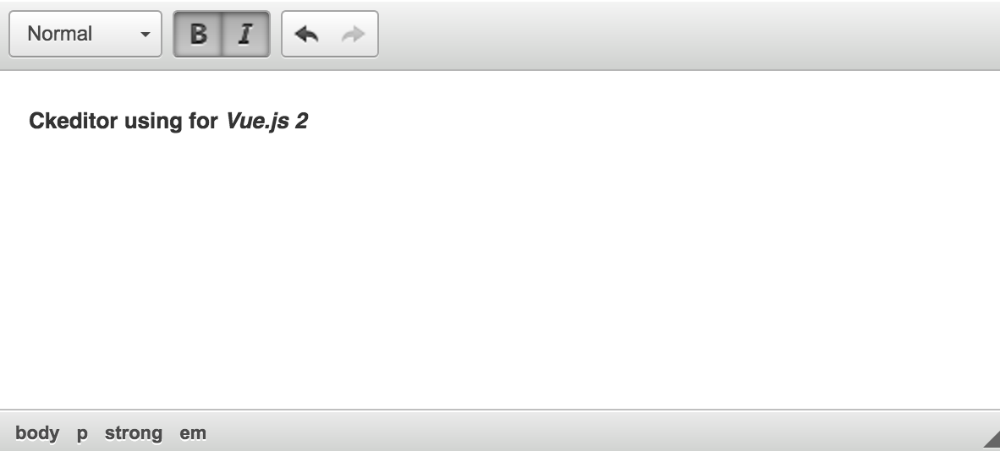

# vue-ckeditor

> Ckeditor using for Vue.js 2



## Notes

- If you use Vue.js 1x please reference from [Ckeditor Vue 1x](https://github.com/dangvanthanh/vue-ckeditor/tree/1.0)

## Usage

### .vue files
```html
<template>
  <div class="app">
    <ckeditor v-model="content"
              :height="300"
              :toolbar="[['Format']]">
    </ckeditor>
  </div>
</template>

<script>
import Ckeditor from './ckeditor.vue'

export default {
  data () {
    return {
      content: ''
    }
  },
  components: { Ckeditor }
}
</script>
```

## Build setup

### [yarn](https://yarnpkg.com) - recommend
``` bash
# Install dependencies
yarn install

# Server with hot reload at localhost:8080
yarn run dev

# Build for production with minification
yarn run build
```

### [npm](https://www.npmjs.com/)
``` bash
# Install dependencies
npm install

# Server with hot reload at localhost:8080
npm run dev

# Build for production with minification
npm run build
```

## Team

[](https://github.com/dangvanthanh) | [](https://github.com/edimoldovan) | [](https://github.com/DominiqueFERET)
---|---|---
[Dang Van Thanh](https://github.com/dangvanthanh) | [Eduárd Moldován](https://github.com/edimoldovan) | [Dominique FERET](https://github.com/DominiqueFERET)

## License

MIT © [Dang Van Thanh](http://dangthanh.org)
